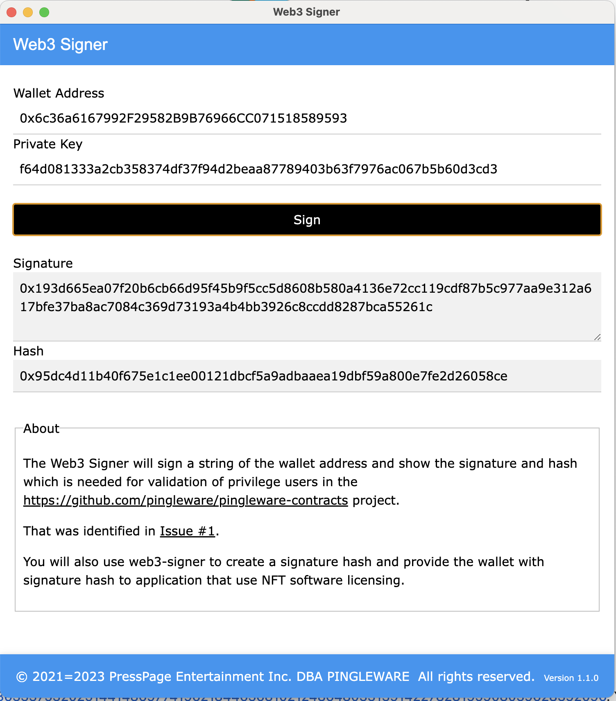
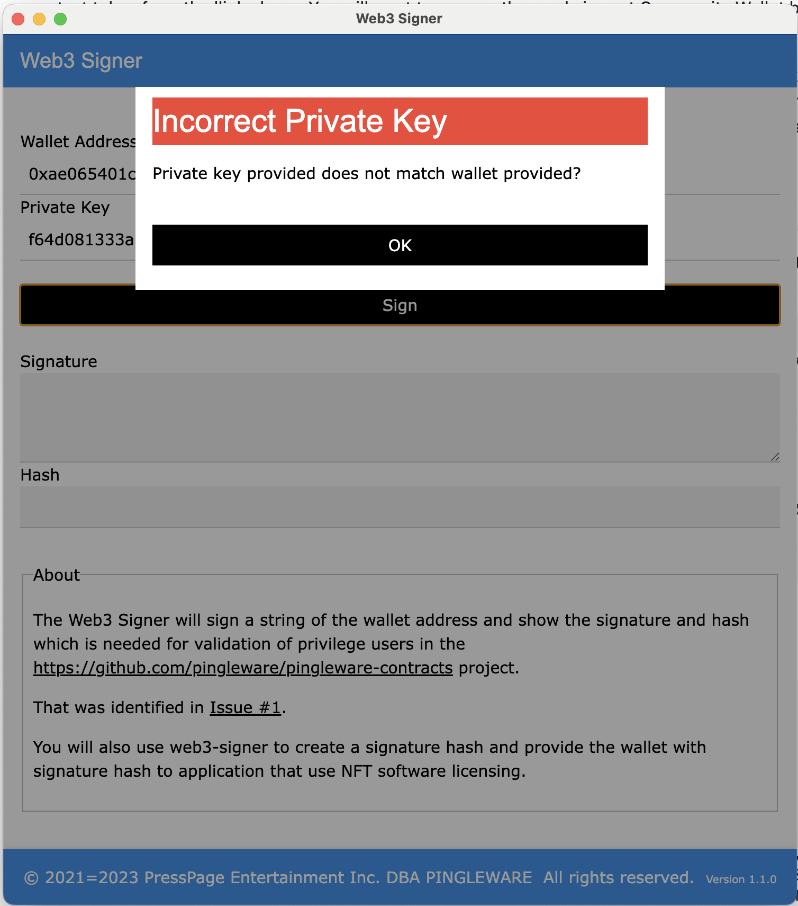

# Web3 Signer

A utility to create a signature and hash of a signed string for use with the https://github.com/pingleware/pingleware-contracts project.

# Preview

The wallet and private key are the COMMUNITY WALLET address and private key generated for the community from [https://github.com/pingleware/pingleware-contracts/tree/main/apps/wallet-creator](https://github.com/pingleware/pingleware-contracts/tree/main/apps/wallet-creator)

and if you try to mismatch the wallet with another private key,

and error is displayed.

# Release Schedule

Whenever the code base is updated, a new standalone executable is created and replaced with the existing executable.

    Version         Date                Description
    1.1.0         12/26/2021        Added check against private key and wallet provided; signature shows in textarea; screenshots added;
    1.0.0         12/29/2021        Initial release

# EOL or End-of-Life

When a piece of software is useful, there should never be an EOL doctrine. The intention for this application is to achieve immoratlity ;).

At some point of time in the future, this project may appear to be dead and abandon. The opposite will be true!

When this project reaches that stage, this project has matured to a level where maintenance is minimal (mostly updating to latest version of Node).

    Patrick Ingle
    Developer
    December 26, 2021
